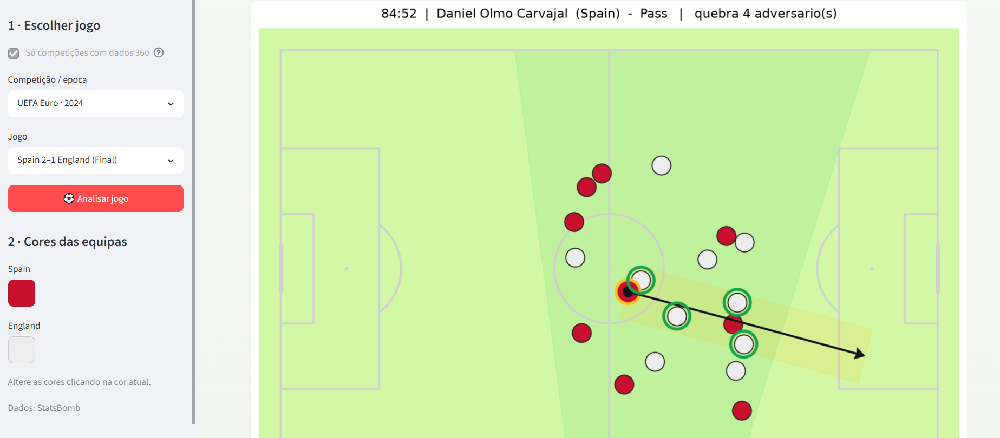
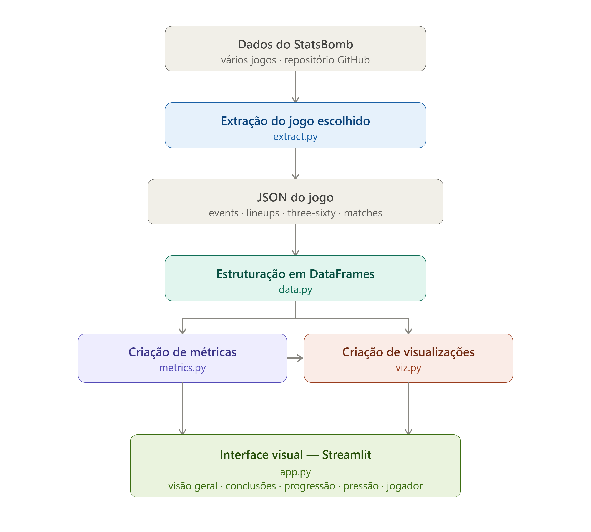

# Football_Analytics

Análise tática de jogos de futebol a partir dos dados abertos da StatsBomb,
com foco nos dados de tracking 360. Exemplo principal: final do Euro 2024.

## Como correr

Depois de clonar o repositório, abrindo o Terminal na diretoria do Projeto, executar sequencialmente os seguintes comandos:

**Windows**

- `python -m venv .venv`
- `.venv\Scripts\Activate.ps1`
- `pip install -r requirements.txt`
- `streamlit run app.py`
​

**Linux / macOS**

- `python3 -m venv .venv`
- `source .venv/bin/activate`
- `pip install -r requirements.txt`
- `streamlit run app.py`
​

## Estrutura
- `data_dir/` — dados do jogo descarregados da StatsBomb, na estrutura do repositório original (gerado pelo `extract.py`; não versionado)
- `outputs/` — ficheiros gerados pela aplicação (visualizações exportadas)
- `src/extract.py` — download seletivo de jogos do repositório StatsBomb
- `src/data.py` — carregamento e estruturação em DataFrames
- `src/metrics.py` — métricas (passes que quebram linhas com 360; ações sob pressão)
- `src/viz.py` — visualizações espaciais (freeze frames, mapa de pressão)
- `app.py` — aplicação Streamlit
- `config.toml` — ficheiro de adição de propriedades à interface Streamlit

## Exemplo de Utilização

## Arquitetura

